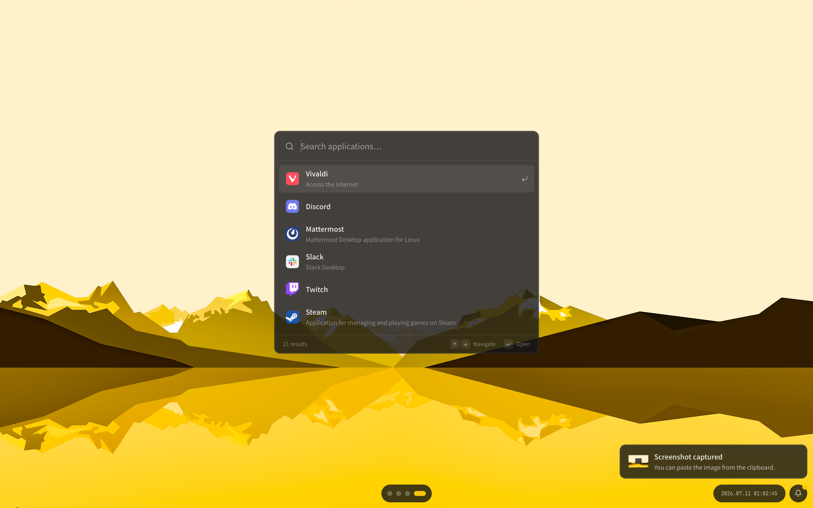

# Linux デスクトップを <br> TypeScript で <br> カスタマイズする

<p class="text-$slidev-theme-primary"># 2026-07-11 Kanto Tech Circle Meetup</p>

---


<p class="text-xl font-bold">🧶 id:mst-mkt</p>

- INIAD
- 情報技術メディア研究会 (GeeKEN)
- NixOS, Niri を使っています
- https://github.com/mst-mkt
- https://mixi.social/@mst_mkt
- https://twitter.com/mst_mkt_

---

```yaml
layout: center
qr: false
```

<p class="text-xl text-center font-bold">本日のスライドはこちらに公開されています</p>

<QrCode class="w-48 mx-auto" url="https://slides.keito.dev/20260711_kanto-tech-circle-meetup/" />

https://slides.keito.dev/20260711_kanto-tech-circle-meetup/

---

```yaml
layout: center
```

# 皆さんどの OS を普段使いしていますか?

---

```yaml
layout: center
```

# 今日は「デスクトップ環境」の話

ウィンドウの管理, バー, ランチャー, 通知 \.\.\.\.\.\.

<div class="grid grid-cols-2 grid-rows-[auto_auto] grid-flow-col justify-items-center gap-4 mt-6">
  <figure class="contents">
    
    <figcaption class="text-sm opacity-70">Windows</figcaption>
  </figure>
  <figure class="contents">
    
    <figcaption class="text-sm opacity-70">私のデスクトップ</figcaption>
  </figure>
</div>

---

# カスタマイズの観点は主に 2 つ

<div class="grid grid-cols-2 gap-4 mt-8">
  <div class="bg-$slidev-theme-panel rounded-lg p-6">
    <div class="text-sm opacity-70">ウィンドウの管理</div>
    <div class="font-bold text-lg mt-1">ウィンドウマネージャ</div>
    <div class="text-sm opacity-70 mt-3">
      ウィンドウの配置・描画・入力を担当<br />
      例: i3wm, sway, hyprland, niri
    </div>
  </div>
  <div class="bg-$slidev-theme-panel border-3 rounded-lg p-6" style="border-color: color-mix(in srgb, var(--slidev-theme-primary) 40%, transparent)">
    <div class="text-sm opacity-70">バー, ランチャー, 通知</div>
    <div class="font-bold text-lg mt-1">デスクトップシェル</div>
    <div class="text-sm opacity-70 mt-3">
      アプリのウィンドウ以外の画面 UI を担当<br />
      例: Waybar, Polybar, <strong>ags</strong>
    </div>
  </div>
</div>

今日は主に右側、デスクトップシェルの話をします

---

# シェルを構築する選択肢はいろいろある

| ツール     | 書くもの                  |
| ---------- | ------------------------- |
| Waybar     | JSONC, CSS                |
| Polybar    | INI                       |
| Quickshell | QML                       |
| **ags**    | **TypeScript (JSX), CSS** |

ags 等は設定ファイルを書くのではなく、プログラムを書く

---

# ags

TypeScript でデスクトップシェルを作るためのフレームワーク

https://aylur.github.io/ags/

- UI を TypeScript (JSX) で宣言的に書く
- スタイルは CSS
- 実体は以下からなる
  - ags (CLI)
  - Astal (システムの状態を扱うライブラリ群)
  - Gnim (JSX ランタイム)

---

# 実際に作成したもの

<div class="grid grid-cols-2 gap-x-2">

<div>

- アプリランチャー


</div>

<div>

- 音楽プレイヤー


- 通知トースト


- バー


</div>

</div>

---

# TypeScript, CSS で書ける嬉しさ

- JSON などの設定ファイルにはない柔軟さと拡張性

<v-click>

- Web フロントエンドに似た感覚で書ける
  - AI も構文でつまずきにくい

</v-click>

<v-click>

- TypeScript, CSS のエコシステムを活用できる
  - エディタや Language Server の支援が効く
  - 開発用のツールも使える
    - pnpm, Vite+, OXC, Vitest
  - npm パッケージもそのまま使える

</v-click>

---

# UI は JSX で書く

```tsx
const Bar = () => {
  const [counter, setCounter] = createState(0)
  const date = createPoll('', 1000, `date "+%H:%M - %A %e."`)

  return (
    <window visible anchor={TOP | LEFT | RIGHT}>
      <centerbox>
        <label $type="start" label={date} />
        <button $type="end" onClicked={() => setCounter((c) => c + 1)}>
          <label label={counter((c) => `clicked ${c} times`)} />
        </button>
      </centerbox>
    </window>
  )
}
```

---

# 外部の状態もリアクティブで型安全

- **リアクティブ** 状態が変わると UI が自動で追従する
- **型安全** プロパティ名も値も型チェックが効く

```tsx
const Battery = () => {
  const battery = AstalBattery.get_default()

  // Accessor<number> に推論される
  const pct = createBinding(battery, 'percentage')
  const percent = pct((p) => `${Math.floor(p * 100)}%`)

  return <label label={percent} />
}
```

---

# いろいろな外部の状態を扱える

Astal というライブラリ群がシステムの状態を提供してくれる

- 通知
- ウィンドウマネージャ
- バッテリー
- Bluetooth
- メディア情報

ほかにもネットワーク, オーディオ, トレイなど

---

```yaml
layout: statement
```

# TypeScript で書けると<br />無限にカスタマイズできる

自分好みのデスクトップは楽しいし快適

---

# 余談: CSS さえ出力できればいいので\.\.\.\.\.\.

UnoCSS などを使用して、生の CSS を書かずにスタイリングすることもできる

自分は GTK 向けの UnoCSS preset を使用して書いている

https://github.com/itt828/unocss-preset-gtk

```tsx
<box class="p-4 rounded-lg bg-blue-500 text-white">
```

---

# 余談: ウィンドウマネージャも TypeScript でカスタマイズ

ShojiWM という TypeScript でカスタマイズするウィンドウマネージャもある
https://github.com/bea4dev/ShojiWM

<video src="https://bea4dev.github.io/ShojiWM/video/example0.mp4" autoplay loop muted playsinline class="rounded-lg h-48 mx-auto" />

---

# まとめ

- Linux デスクトップはカスタマイズが醍醐味
- デスクトップシェルを TypeScript で書ける ags がある
- TypeScript で書くと柔軟で拡張性が高い
- 自分好みの快適でかっこいいデスクトップをつくろう

---

# リンクなど

- スライド [slides.keito.dev/20260711_kanto-tech-circle-meetup](https://slides.keito.dev/20260711_kanto-tech-circle-meetup/)
- 私の設定 [mst-mkt/widgets](https://github.com/mst-mkt/widgets), [mst-mkt/dotfiles](https://github.com/mst-mkt/dotfiles)
- 紹介したもの
  - [ags](https://aylur.github.io/ags/), [Astal](https://aylur.github.io/astal/)
  - [unocss-preset-gtk](https://github.com/itt828/unocss-preset-gtk)
  - [ShojiWM](https://bea4dev.github.io/ShojiWM/)

---

```yaml
layout: end
qr: false
```

2026-07-11

KANTO TECH CIRCLE MEETUP
